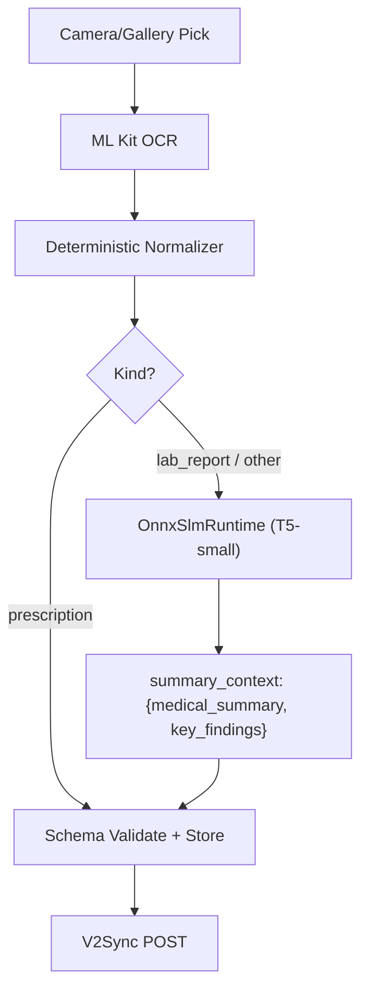
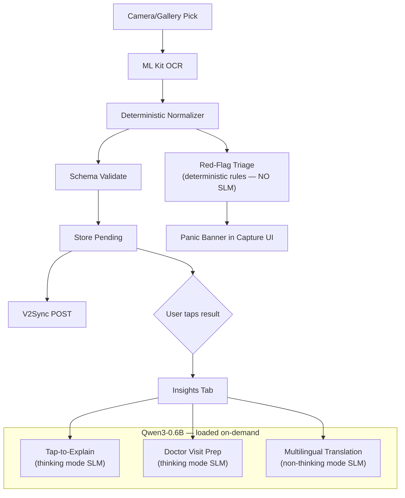

# Implementation Plan: Replace T5 with Qwen3-0.6B + New Mobile Features

## Goal

Replace the current on-device T5-small ONNX standardizer (~94 MB, seq2seq summarizer, loops on short text) with **Qwen3-0.6B** (~300 MB Q3_K_M GGUF, instruction-tuned causal decoder with thinking/non-thinking mode) via the existing `llama_cpp_dart` dependency, and build four new patient-facing features powered by the upgraded SLM:

1. **Tap-to-Explain** — 1-sentence layperson explanation for any flagged biomarker *(thinking mode)*
2. **Doctor Visit Prep** — 3-bullet checklist generated from recent lab abnormalities *(thinking mode)*
3. **Multilingual Dosage Translation** — translate medication instructions into regional languages *(non-thinking mode)*
4. **Red-Flag Triage Banner** — instant visual alert for panic-value lab results *(deterministic, no SLM)*

**Excluded** (per user request): Pill reminder engine, chatbot / "Ask My Report" interactive Q&A.

---

## Why Qwen3-0.6B (not Qwen2.5-0.5B or Qwen3.5-0.8B)

| Feature / Metric | **Qwen2.5-0.5B** | **Qwen3-0.6B** ✅ | **Qwen3.5-0.8B** ❌ |
|:--|:--|:--|:--|
| Parameters | 490M | 600M (440M non-embed) | 800M |
| Architecture | Standard transformer | Standard transformer | Gated DeltaNet + MoE |
| Modality | Text only | Text only | Vision + Language |
| Q3_K_M GGUF size | ~250 MB | **~300 MB** | ~400 MB (if supported) |
| `llama_cpp_dart` compat | ✅ `ChatMLFormat` | ✅ `ChatMLFormat` | ❌ Unsupported arch |
| Thinking mode | ❌ | ✅ Toggle per-prompt | ✅ |
| Instruction quality | Good | **Better** (surpasses 2.5) | Best (but unusable) |
| Multilingual | Strong | **Stronger** | Strongest |

**Qwen3.5-0.8B is ruled out** — it is a multimodal vision-language model using a novel Gated DeltaNet + sparse MoE architecture that `llama.cpp` (and therefore `llama_cpp_dart: ^0.2.2`) does not support. It uses `AutoModelForMultimodalLM`, not `AutoModelForCausalLM`.

**Qwen3-0.6B wins** because it is a standard causal transformer with thinking/non-thinking mode, ~300 MB at Q3, and full `llama.cpp` compatibility. The thinking mode enables higher-quality reasoning for explanations while non-thinking mode keeps translation fast.

---

## User Review Required

> [!IMPORTANT]
> **Model Delivery Strategy** — The Qwen3-0.6B Q3_K_M GGUF file is ~300 MB. Two options:
> - **Option A: Bundle in APK** — Placed in `assets/models/`, ships with the app. Total APK grows to ~400 MB. Simplest for PBL demo.
> - **Option B: On-demand download** — APK stays ~30 MB; model downloads on first launch to `getApplicationDocumentsDirectory()`. Better for production.
>
> **Recommendation:** Option A for PBL deliverable (offline-first demo, no CDN needed). Switch to Option B later for Play Store.

> [!WARNING]
> **T5 Assets Removal** — After the switch, the three T5 ONNX files (`t5_encoder_q8.onnx` 35.5 MB, `t5_decoder_q8.onnx` 58.5 MB, `t5_tokenizer.json` 2.4 MB) become dead weight. The plan removes them from the asset bundle and deletes `t5_tokenizer.dart`. The T5 code path in `OnnxSlmRuntime` is kept but marked `@Deprecated` and bypassed, so git history preserves it.

> [!IMPORTANT]
> **Drug Interaction & Panic Value Data** — The Red-Flag Triage feature uses a local JSON lookup table of ~40 panic-value ranges (sourced from standard clinical reference ranges) and a drug-interaction pair list (~50 common contraindicated pairs). These are bundled as a static asset (`assets/data/clinical_rules.json`), NOT generated by the SLM. The SLM only generates the human-readable explanation text. This keeps safety-critical logic deterministic and auditable.

## Open Questions

> [!IMPORTANT]
> **Which regional languages should the multilingual feature support at launch?** The plan defaults to **Hindi** and **Spanish** as the two initial target languages (Qwen3 has strong coverage for both). More can be added by updating a config list. Please confirm or specify different languages.

> [!IMPORTANT]
> **GGUF File Sourcing** — The plan assumes downloading `Qwen3-0.6B-Q3_K_M.gguf` from HuggingFace (community GGUF quantization repo or official). You will need to manually download this file (~300 MB) and place it at `mobile/assets/models/qwen3-0.6b-q3_k_m.gguf` before the first build. A download script will be provided.

---

## Architecture Overview

### Current Pipeline (T5 ONNX)



### New Pipeline (Qwen3-0.6B GGUF)



**Key architectural change:** The SLM is no longer in the critical capture path. Deterministic normalization + schema validation + store + sync happens WITHOUT the SLM (same as current prescription path). The SLM is invoked **on-demand** when the user opens the new Insights tab for a specific result. This means:
- **Capture is faster** — no 94 MB model load on first document
- **Capture never fails** due to SLM issues
- **The SLM does higher-value work** (explanations, prep, translation) rather than low-value summarization

### Thinking Mode Strategy

Qwen3 supports `<think>...</think>` blocks that enable chain-of-thought reasoning when quality matters, and `/no_think` to suppress it when speed matters:

| Feature | Mode | Why |
|:--|:--|:--|
| Tap-to-Explain | **Thinking** | Needs to reason about what a biomarker measures and what the abnormal value implies |
| Doctor Visit Prep | **Thinking** | Needs to synthesize multiple abnormal values into coherent questions |
| Multilingual Translation | **Non-thinking** (`/no_think`) | Translation is pattern-matching, not reasoning — faster without CoT |
| Summary Context (backward compat) | **Non-thinking** | Speed over depth, matching the old T5 behavior |

---

## Proposed Changes

### Component 1: SLM Runtime — Wire `llama_cpp_dart` with Qwen3-0.6B

---

#### [MODIFY] `mobile/lib/slm_runtime.dart`

**What changes:** The `LlamaCppRuntime` class (currently a stub at L32-59) is replaced by a fully wired `QwenSlmRuntime` class using `llama_cpp_dart`'s managed isolate API (`LlamaParent`). The `OnnxSlmRuntime` is deprecated but left intact for git history. Task-specific prompt methods handle thinking/non-thinking mode per-task.

```dart
// NEW: Qwen3-0.6B runtime via llama_cpp_dart managed isolate
import 'dart:async';
import 'package:llama_cpp_dart/llama_cpp_dart.dart';

/// Qwen3-0.6B runtime on llama.cpp. Uses ChatML format with thinking/
/// non-thinking mode control per-task.
///
/// Thinking mode:   model emits <think>...</think> before the answer —
///                  better reasoning for explanations and visit prep.
/// Non-thinking:    prefix user prompt with "/no_think" — faster output
///                  for translation and summary tasks.
class QwenSlmRuntime implements SlmRuntime {
  QwenSlmRuntime({required this.modelPath});

  final String modelPath;
  LlamaParent? _llama;
  bool _ready = false;

  @override
  SlmBackend get backend => SlmBackend.llamaCpp;

  @override
  bool get isReady => _ready;

  @override
  Future<void> load() async {
    final loadCommand = LlamaLoad(
      path: modelPath,
      modelParams: ModelParams()
        ..nGpuLayers = 0,       // CPU-only on mobile
      contextParams: ContextParams()
        ..contextSize = 2048    // bounded tasks, save RAM
        ..batchSize = 128,
      samplingParams: SamplerParams()
        ..temp = 0.2            // near-deterministic for extraction
        ..topK = 20
        ..topP = 0.9
        ..penaltyRepeat = 1.15,
      format: ChatMLFormat(),   // Qwen3 uses ChatML
    );
    _llama = LlamaParent(loadCommand);
    await _llama!.init();
    _ready = true;
  }

  /// Build a ChatML prompt. When [enableThinking] is false, the user
  /// message is prefixed with "/no_think" to suppress the <think> block.
  String _buildPrompt(String system, String user, {bool enableThinking = true}) {
    final effectiveUser = enableThinking ? user : '/no_think\n$user';
    return '<|im_start|>system\n$system<|im_end|>\n'
           '<|im_start|>user\n$effectiveUser<|im_end|>\n'
           '<|im_start|>assistant\n';
  }

  /// Strip any <think>...</think> block from the model output,
  /// returning only the final answer portion.
  String _stripThinking(String raw) {
    final thinkEnd = raw.indexOf('</think>');
    if (thinkEnd >= 0) {
      return raw.substring(thinkEnd + '</think>'.length).trim();
    }
    // If model didn't emit a think block, return as-is
    return raw.trim();
  }

  /// Run a single-turn prompt and collect the full response.
  Future<String> _complete(
    String systemPrompt,
    String userPrompt, {
    bool enableThinking = true,
  }) async {
    if (!_ready) throw StateError('QwenSlmRuntime not loaded');
    final llama = _llama!;
    final buffer = StringBuffer();
    final completer = Completer<String>();
    late StreamSubscription<String> sub;
    sub = llama.stream.listen(
      (token) {
        if (token == '') {
          if (!completer.isCompleted) {
            completer.complete(_stripThinking(buffer.toString()));
          }
          sub.cancel();
        } else {
          buffer.write(token);
        }
      },
      onDone: () {
        if (!completer.isCompleted) {
          completer.complete(_stripThinking(buffer.toString()));
        }
      },
      onError: (e) {
        if (!completer.isCompleted) completer.completeError(e);
      },
    );
    llama.sendPrompt(_buildPrompt(
      systemPrompt, userPrompt, enableThinking: enableThinking,
    ));
    return completer.future.timeout(
      const Duration(seconds: 90),
      onTimeout: () {
        sub.cancel();
        return _stripThinking(buffer.toString()); // partial on timeout
      },
    );
  }

  // ── Task-Specific Methods ──────────────────────────────────

  /// Explain a single biomarker in 1-2 sentences for a patient.
  /// Uses THINKING mode for better medical reasoning.
  Future<String> explainBiomarker({
    required String testName,
    required String value,
    required String unit,
    String? direction,
  }) {
    final dirText = direction != null ? ' ($direction)' : '';
    return _complete(
      'You are a patient health educator. Explain the medical test '
      'result in 1-2 simple sentences a patient can understand. '
      'Do NOT give medical advice or suggest treatment. '
      'Do NOT use the word "diagnos". Just explain what the test measures '
      'and what the result level generally indicates.',
      '$testName: $value $unit$dirText',
      enableThinking: true, // reason about what the biomarker means
    );
  }

  /// Generate 3 questions for a patient's next doctor visit.
  /// Uses THINKING mode for better synthesis of multiple abnormal values.
  Future<String> doctorVisitPrep({
    required List<Map<String, dynamic>> abnormalTests,
  }) {
    final listing = abnormalTests.map((t) =>
      '- ${t['test_name']}: ${t['value']} ${t['unit']} '
      '(${t['direction'] ?? 'flagged'})').join('\n');
    return _complete(
      'You are a patient health educator preparing a patient for '
      'their next doctor appointment. Given the flagged lab results, '
      'generate exactly 3 specific questions the patient should ask '
      'their doctor. Number them 1-3. Keep each question to 1 sentence. '
      'Do NOT give medical advice or suggest treatment.',
      'My flagged lab results:\n$listing',
      enableThinking: true, // reason across multiple test values
    );
  }

  /// Translate dosage instructions into a target language.
  /// Uses NON-THINKING mode for fast, direct translation.
  Future<String> translateInstructions({
    required String instructions,
    required String targetLanguage,
  }) {
    return _complete(
      'You are a medical translator. Translate the following '
      'medication instructions into $targetLanguage. '
      'Translate ONLY the instructions, keep drug names in English. '
      'Be precise with dosage numbers and timing.',
      instructions,
      enableThinking: false, // translation is pattern-matching, skip CoT
    );
  }

  /// Produce a medical summary (backward-compat shim replacing T5
  /// standardizeText for non-prescription documents).
  /// Uses NON-THINKING mode to match old T5 speed profile.
  Future<Map<String, dynamic>> standardizeText(String ocrText) async {
    final summary = await _complete(
      'You are a medical document normalization engine. Summarize '
      'the following medical text in 2-3 sentences. Extract key '
      'findings as a bullet list. Do NOT interpret or diagnose. '
      'Output plain text, not JSON.',
      'Medical text:\n$ocrText',
      enableThinking: false, // fast summary, not deep reasoning
    );
    return {
      'medical_summary': summary.trim(),
      'key_findings': _extractBullets(summary),
      'model': 'qwen3-0.6b-q3',
    };
  }

  List<String> _extractBullets(String text) {
    return text
        .split('\n')
        .where((l) => l.trim().startsWith('-') || l.trim().startsWith('•'))
        .map((l) => l.replaceFirst(RegExp(r'^[\s\-•]+'), '').trim())
        .where((l) => l.isNotEmpty)
        .toList();
  }

  @override
  Future<Map<String, dynamic>> normalizeJson(String stage1Json) {
    throw UnimplementedError(
      'QwenSlmRuntime uses task-specific methods, not normalizeJson');
  }

  @override
  Future<void> close() async {
    _llama?.dispose();
    _llama = null;
    _ready = false;
  }
}
```

**`LlamaCppRuntime`** (L32-59) is removed. `QwenSlmRuntime` replaces it as the canonical `SlmBackend.llamaCpp` implementation.

**`OnnxSlmRuntime`** (L75-329) is annotated `@Deprecated('Use QwenSlmRuntime — T5 ONNX path replaced by Qwen3 GGUF')` but the class body is left intact for git history.

---

#### [MODIFY] `mobile/lib/model_manager.dart`

**What changes:**
1. `loadSlm()` now creates `QwenSlmRuntime` instead of choosing between `LlamaCppRuntime` / `OnnxSlmRuntime`
2. `processDocument()` (L96-186): **Remove the T5 standardizer block** (L122-137 — the `if (kind != 'prescription' && !_slmUnavailable)` block). The engine is always `'deterministic-v1'`. Captures are faster and never block on model loading.
3. New method `runInsightTask()` wraps SLM calls through the `InferenceQueue` for the Insights tab features.

```dart
// CHANGE in loadSlm() — L74-94:
Future<SlmRuntime> loadSlm(SlmBackend backend) async {
  final started = DateTime.now();
  var runtime = slm;
  if (runtime == null) {
    // Qwen3-0.6B via llama_cpp_dart (replaces T5 ONNX)
    runtime = QwenSlmRuntime(modelPath: slmGgufAsset);
    slm = runtime;
  }
  try {
    await runtime.load();
  } catch (e) {
    if (identical(slm, runtime)) slm = null;
    rethrow;
  }
  slmLoadedAt ??= DateTime.now();
  slmLoadMs = DateTime.now().difference(started).inMilliseconds;
  return runtime;
}

// DELETE in processDocument() — L122-137:
// The entire "if (kind != 'prescription' && !_slmUnavailable)" block
// is removed. Engine is always 'deterministic-v1'.
// summary_context is no longer populated at capture time.

// ADD new method after processXray():
/// Run an SLM-powered insight task through the serial queue.
/// Lazily loads Qwen3 on first call.
Future<String> runInsightTask(Future<String> Function(QwenSlmRuntime) task) {
  return queue.add(() async {
    if (_slmUnavailable) {
      throw StateError('SLM unavailable after prior failure');
    }
    try {
      final runtime = slm ?? await loadSlm(SlmBackend.llamaCpp);
      if (runtime is! QwenSlmRuntime) {
        throw StateError('Expected QwenSlmRuntime, got ${runtime.runtimeType}');
      }
      return await task(runtime);
    } catch (e) {
      _slmUnavailable = true;
      rethrow;
    }
  });
}
```

---

#### [DELETE] `mobile/lib/t5_tokenizer.dart`

The SentencePiece Unigram Viterbi tokenizer (~5 KB) was only used by `OnnxSlmRuntime`. With Qwen3 via `llama_cpp_dart`, tokenization is handled internally by `llama.cpp`. File deleted.

---

#### [MODIFY] `mobile/lib/main.dart`

**Change 1 — GGUF asset default (L22-25):**
```dart
// BEFORE:
const slmGgufAsset = String.fromEnvironment(
  'SLM_GGUF_ASSET',
  defaultValue: 'assets/models/slm_norm_q4.gguf',
);

// AFTER:
const slmGgufAsset = String.fromEnvironment(
  'SLM_GGUF_ASSET',
  defaultValue: 'assets/models/qwen3-0.6b-q3_k_m.gguf',
);
```

**Change 2 — Add Insights tab to pages list (L149-161):**
```dart
// BEFORE:
final pages = [
  CaptureTab(models: widget.models, sync: widget.sync, onResultsChanged: ...),
  ResultsTab(refreshToken: _resultsToken, sync: widget.sync, auth: widget.auth),
  BenchTab(models: widget.models, sync: widget.sync),
  SpikeTab(models: widget.models),
];

// AFTER:
final pages = [
  CaptureTab(models: widget.models, sync: widget.sync, onResultsChanged: ...),
  ResultsTab(refreshToken: _resultsToken, sync: widget.sync, auth: widget.auth),
  InsightsTab(models: widget.models),  // NEW
  BenchTab(models: widget.models, sync: widget.sync),
  SpikeTab(models: widget.models),
];
```

---

### Component 2: Clinical Rules Engine (Deterministic — No SLM)

---

#### [NEW] `mobile/lib/clinical_rules.dart`

A pure-Dart deterministic rules engine. **No models, no network, no side effects** — mirrors the backend's Stage 3 `rule_engine.py` philosophy.

- **Panic-value detection** — checks numeric test values against critical thresholds from `clinical_rules.json`
- **Drug interaction checking** — cross-references active medications from local store against known contraindicated pairs

```dart
import 'dart:convert';
import 'package:flutter/services.dart' show rootBundle;

class ClinicalRules {
  ClinicalRules._(this._panicRanges, this._drugInteractions);

  final Map<String, PanicRange> _panicRanges;
  final List<DrugInteraction> _drugInteractions;

  static ClinicalRules? _instance;

  static Future<ClinicalRules> load() async {
    if (_instance != null) return _instance!;
    final json = await rootBundle.loadString('assets/data/clinical_rules.json');
    final data = jsonDecode(json) as Map<String, dynamic>;

    final ranges = <String, PanicRange>{};
    for (final e in (data['panic_ranges'] as List)) {
      ranges[e['test_name'].toString().toLowerCase()] = PanicRange(
        testName: e['test_name'],
        criticalLow: (e['critical_low'] as num?)?.toDouble(),
        criticalHigh: (e['critical_high'] as num?)?.toDouble(),
        unit: e['unit'] ?? '',
        message: e['message'] ?? '',
      );
    }

    final interactions = <DrugInteraction>[];
    for (final e in (data['drug_interactions'] as List)) {
      interactions.add(DrugInteraction(
        drugA: e['drug_a'].toString().toLowerCase(),
        drugB: e['drug_b'].toString().toLowerCase(),
        severity: e['severity'] ?? 'moderate',
        message: e['message'] ?? '',
      ));
    }

    _instance = ClinicalRules._(ranges, interactions);
    return _instance!;
  }

  /// Check a list of test results for panic values.
  List<PanicAlert> checkPanicValues(List<Map<String, dynamic>> tests) {
    final alerts = <PanicAlert>[];
    for (final test in tests) {
      final name = (test['test_name'] as String?)?.toLowerCase() ?? '';
      final value = test['value'] as num?;
      if (value == null) continue;
      final range = _panicRanges[name];
      if (range == null) continue;
      if (range.criticalLow != null && value < range.criticalLow!) {
        alerts.add(PanicAlert(
          testName: range.testName, value: value.toDouble(),
          unit: range.unit, direction: 'critically_low',
          message: range.message,
        ));
      }
      if (range.criticalHigh != null && value > range.criticalHigh!) {
        alerts.add(PanicAlert(
          testName: range.testName, value: value.toDouble(),
          unit: range.unit, direction: 'critically_high',
          message: range.message,
        ));
      }
    }
    return alerts;
  }

  /// Check medications for known drug-drug interactions.
  List<DrugInteraction> checkInteractions(List<String> medications) {
    final meds = medications.map((m) => m.toLowerCase()).toSet();
    return _drugInteractions.where((i) =>
      meds.contains(i.drugA) && meds.contains(i.drugB)).toList();
  }
}

class PanicRange {
  const PanicRange({
    required this.testName, this.criticalLow, this.criticalHigh,
    this.unit = '', this.message = '',
  });
  final String testName;
  final double? criticalLow;
  final double? criticalHigh;
  final String unit;
  final String message;
}

class PanicAlert {
  const PanicAlert({
    required this.testName, required this.value, required this.unit,
    required this.direction, required this.message,
  });
  final String testName;
  final double value;
  final String unit;
  final String direction; // "critically_low" | "critically_high"
  final String message;
}

class DrugInteraction {
  const DrugInteraction({
    required this.drugA, required this.drugB,
    required this.severity, required this.message,
  });
  final String drugA;
  final String drugB;
  final String severity; // "high" | "moderate" | "low"
  final String message;
}
```

---

#### [NEW] `mobile/assets/data/clinical_rules.json`

Static lookup table with ~40 panic value thresholds and ~50 common drug interaction pairs. Sample:

```json
{
  "panic_ranges": [
    { "test_name": "Hemoglobin", "critical_low": 7.0, "critical_high": 20.0,
      "unit": "g/dL", "message": "Hemoglobin is outside the critical range. Please consult your doctor promptly." },
    { "test_name": "Platelet Count", "critical_low": 20000, "critical_high": 1000000,
      "unit": "/µL", "message": "Platelet count is at a critical level. Please seek medical attention." },
    { "test_name": "Potassium", "critical_low": 2.5, "critical_high": 6.5,
      "unit": "mEq/L", "message": "Potassium level is critical. Contact your healthcare provider immediately." },
    { "test_name": "Fasting Blood Glucose", "critical_low": 40, "critical_high": 500,
      "unit": "mg/dL", "message": "Blood glucose is at a dangerous level. Seek immediate medical attention." },
    { "test_name": "Serum Creatinine", "critical_low": null, "critical_high": 10.0,
      "unit": "mg/dL", "message": "Creatinine is critically elevated, suggesting severe kidney impairment." }
  ],
  "drug_interactions": [
    { "drug_a": "warfarin", "drug_b": "aspirin", "severity": "high",
      "message": "Concurrent use increases bleeding risk significantly." },
    { "drug_a": "metformin", "drug_b": "alcohol", "severity": "high",
      "message": "Risk of lactic acidosis. Discuss with your doctor." },
    { "drug_a": "lisinopril", "drug_b": "potassium", "severity": "moderate",
      "message": "ACE inhibitors can raise potassium levels. Monitor closely." }
  ]
}
```

Full file: ~40 panic ranges (CBC, metabolic, liver, renal, thyroid, coagulation) + ~50 drug pairs from standard clinical pharmacology.

---

### Component 3: New UI — Insights Tab + Triage Banner

---

#### [NEW] `mobile/lib/tabs_insights.dart`

A new top-level tab (between Results and Bench in the drawer). When a user taps a result row, it opens a detail page with SLM-powered insight cards.

**InsightsTab layout:**
```
┌──────────────────────────────────────┐
│  Insights                            │
│  Select a result to see AI insights  │
├──────────────────────────────────────┤
│  [Result Row 1 - Lab Report]    →    │
│  [Result Row 2 - Prescription]  →    │
│  [Result Row 3 - X-ray]        →    │
└──────────────────────────────────────┘
```

**InsightsDetailPage layout (for a Lab Report):**
```
┌──────────────────────────────────────┐
│  ← Lab Report #4                     │
├──────────────────────────────────────┤
│  🔴 RED FLAG ALERT                   │  ← PanicAlert banner (if any)
│  Potassium 7.2 mEq/L — critically   │
│  high. Contact healthcare provider.  │
├──────────────────────────────────────┤
│  📋 Test Results                     │
│  ┌────────────────────────────────┐  │
│  │ Hemoglobin  11.2 g/dL    ⓘ   │  │  ← ⓘ = Tap-to-Explain
│  │ WBC         7.5 /µL      ⓘ   │  │    (thinking mode SLM)
│  │ Potassium   7.2 mEq/L 🔴 ⓘ   │  │
│  └────────────────────────────────┘  │
├──────────────────────────────────────┤
│  🩺 Doctor Visit Prep                │
│  [Generate 3 Questions]             │  ← Thinking mode SLM
│  1. Should we recheck potassium...   │
│  2. Is the hemoglobin trend...       │
│  3. Are there dietary changes...     │
├──────────────────────────────────────┤
│  🌐 Translate Instructions           │  ← Only for prescriptions
│  [Hindi 🇮🇳] [Spanish 🇪🇸]            │    Non-thinking mode SLM
│  "दिन में दो बार खाने के बाद..."     │
├──────────────────────────────────────┤
│  ⚠️ For reference only — consult     │
│  your doctor for medical decisions.  │
└──────────────────────────────────────┘
```

Key implementation details:
- Each SLM call is wrapped in `ModelManager.runInsightTask()` → `InferenceQueue` (serial, no overlap)
- Results are cached in a local `Map<int, InsightCache>` keyed by result row ID so re-opening doesn't re-infer
- **SLM loads lazily** on first insight request (not at app startup)
- All SLM-generated text is displayed under a "For reference only — consult your doctor" disclaimer
- Uses existing `AppCard`, `StatusChip`, `SectionTitle` widgets from `lib/widgets/`

---

#### [MODIFY] `mobile/lib/tabs_capture_results.dart`

**What changes:**
1. After `processDocument()` / `processXray()` completes, run `ClinicalRules.checkPanicValues()` against the extracted tests
2. If any `PanicAlert` is returned, display a red `_PanicBanner` below `_StatusBanner`
3. Banner uses the same left-accent design as `_StatusBanner` but with red tones

```dart
// In _CaptureTabState._pick(), after "Structured context ready..." setState:
if (_kind == 'lab_report') {
  final rules = await ClinicalRules.load();
  final tests = _extractTests(envelope);
  final alerts = rules.checkPanicValues(tests);
  if (alerts.isNotEmpty && mounted) {
    setState(() => _panicAlerts = alerts);
  }
}

// New widget in CaptureTab.build(), after _StatusBanner:
if (_panicAlerts.isNotEmpty)
  Padding(
    padding: const EdgeInsets.only(top: 16),
    child: _PanicBanner(alerts: _panicAlerts),
  ),
```

The `_PanicBanner` widget — red left-accent banner matching the `_StatusBanner` visual pattern:
```dart
class _PanicBanner extends StatelessWidget {
  const _PanicBanner({required this.alerts});
  final List<PanicAlert> alerts;

  @override
  Widget build(BuildContext context) {
    final theme = Theme.of(context);
    return ClipRRect(
      borderRadius: BorderRadius.circular(AppRadius.card),
      child: Container(
        color: Colors.red.withValues(alpha: 0.08),
        child: IntrinsicHeight(
          child: Row(
            crossAxisAlignment: CrossAxisAlignment.stretch,
            children: [
              Container(width: 3, color: Colors.red),
              Expanded(
                child: Padding(
                  padding: const EdgeInsets.all(16),
                  child: Column(
                    crossAxisAlignment: CrossAxisAlignment.start,
                    children: [
                      Row(children: [
                        const Icon(Icons.warning_amber, color: Colors.red, size: 20),
                        const SizedBox(width: 8),
                        Text('Values Outside Critical Range',
                          style: theme.textTheme.labelLarge?.copyWith(color: Colors.red)),
                      ]),
                      const SizedBox(height: 8),
                      for (final a in alerts)
                        Padding(
                          padding: const EdgeInsets.only(bottom: 4),
                          child: Text('${a.testName}: ${a.value} ${a.unit} — ${a.message}',
                            style: theme.textTheme.bodySmall),
                        ),
                      const SizedBox(height: 8),
                      Text('Please ensure your prescribing doctor reviews this report promptly.',
                        style: theme.textTheme.bodySmall?.copyWith(fontStyle: FontStyle.italic)),
                    ],
                  ),
                ),
              ),
            ],
          ),
        ),
      ),
    );
  }
}
```

---

#### [MODIFY] `mobile/lib/widgets/app_drawer.dart`

**What changes:** Add "Insights" as a user-facing nav item at index 2 (between Results and Bench):

```dart
// BEFORE (L36-58):
static const items = <AppNavItem>[
  AppNavItem(label: 'Capture', icon: Icons.document_scanner_outlined, selectedIcon: Icons.document_scanner),
  AppNavItem(label: 'Results', icon: Icons.list_alt_outlined, selectedIcon: Icons.list_alt),
  AppNavItem(label: 'Bench', ..., developer: true),
  AppNavItem(label: 'Spike', ..., developer: true),
];

// AFTER:
static const items = <AppNavItem>[
  AppNavItem(label: 'Capture', icon: Icons.document_scanner_outlined, selectedIcon: Icons.document_scanner),
  AppNavItem(label: 'Results', icon: Icons.list_alt_outlined, selectedIcon: Icons.list_alt),
  AppNavItem(label: 'Insights', icon: Icons.insights_outlined, selectedIcon: Icons.insights),  // NEW
  AppNavItem(label: 'Bench', ..., developer: true),
  AppNavItem(label: 'Spike', ..., developer: true),
];
```

---

#### [MODIFY] `mobile/lib/copy.dart`

Add insight-related copy strings:

```dart
/// Disclaimer shown under all SLM-generated insight text.
const insightDisclaimer =
    'For reference only — consult your doctor for medical decisions.';

/// Caption for the Insights tab.
const insightsCaption =
    'AI-powered insights generated on-device using Qwen3. '
    'Results are not medical advice.';
```

---

### Component 4: Asset & Dependency Changes

---

#### [MODIFY] `mobile/pubspec.yaml`

```yaml
# ADD to assets list (L83-85):
assets:
  - assets/models/
  - assets/data/        # NEW — clinical_rules.json
  - assets/sample/
  - assets/fonts/
```

No new pub dependencies needed — `llama_cpp_dart: ^0.2.2` is already in pubspec.yaml.

---

#### [NEW] `mobile/assets/models/qwen3-0.6b-q3_k_m.gguf`

Qwen3-0.6B quantized to Q3_K_M (~300 MB). Downloaded from HuggingFace community GGUF repo. Manual download required before first build.

#### [DELETE] Assets (after migration confirmed working)

| File | Size | Reason |
|:--|:--|:--|
| `mobile/assets/models/t5_encoder_q8.onnx` | 35.5 MB | Replaced by Qwen3 GGUF |
| `mobile/assets/models/t5_decoder_q8.onnx` | 58.5 MB | Replaced by Qwen3 GGUF |
| `mobile/assets/models/t5_tokenizer.json` | 2.4 MB | Replaced by llama.cpp internal tokenizer |

**Net asset change:** -96 MB (T5) + 300 MB (Qwen3) = **+204 MB**, but dramatically more capability.

---

### Component 5: Updated Documentation

---

#### [MODIFY] `mobile/docs/APP_SPIKE.md`

Add new section:

```markdown
## 5. Qwen3-0.6B Migration (this session)

- **Decision: Replace T5-small ONNX with Qwen3-0.6B Q3_K_M GGUF.**
  Rationale: T5-small is an encoder-decoder summarizer that loops on short
  lab values and cannot follow instructions. Qwen3-0.6B is an instruction-
  tuned causal decoder (600M params, Q3_K_M ~300 MB) with thinking/non-
  thinking mode that excels at structured extraction and multilingual output.

- **Why not Qwen3.5-0.8B:** Qwen3.5 is a multimodal vision-language model
  using a novel Gated DeltaNet + sparse MoE architecture. `llama.cpp` (and
  `llama_cpp_dart: ^0.2.2`) does not support this architecture. It uses
  `AutoModelForMultimodalLM`, not `AutoModelForCausalLM`.

- **Runtime:** `llama_cpp_dart` managed isolate (`LlamaParent` + `ChatMLFormat`).
  The `flutter_onnxruntime` T5 path is deprecated but kept in git history.

- **Pipeline change:** SLM removed from critical capture path. Deterministic
  normalization always runs first (fast, reliable). SLM invoked on-demand
  for Insights tab features (explain, visit prep, translate).

- **Thinking mode strategy:**
  - Thinking ON: Tap-to-Explain, Doctor Visit Prep (quality matters)
  - Thinking OFF (`/no_think`): Translation, Summary (speed matters)
```

---

#### [MODIFY] `mobile/README.md`

Update the "Layout" section to document new files: `lib/clinical_rules.dart`, `lib/tabs_insights.dart`, `assets/data/clinical_rules.json`, and the Insights tab.

---

### Component 6: Test Updates

---

#### [MODIFY] `mobile/test/inference_correctness_test.dart`

Add unit tests for:
- `QwenSlmRuntime._buildPrompt()` — verify ChatML format and `/no_think` prefix
- `QwenSlmRuntime._stripThinking()` — verify `<think>...</think>` extraction
- `ClinicalRules.checkPanicValues()` — panic value detection
- `ClinicalRules.checkInteractions()` — drug pair matching

#### [MODIFY] `mobile/integration_test/slm_on_device_test.dart`

Replace T5 load/standardize test with Qwen3 load + explainBiomarker test:

```dart
testWidgets('Qwen3-0.6B loads and produces biomarker explanation', (tester) async {
  final slm = QwenSlmRuntime(
    modelPath: 'assets/models/qwen3-0.6b-q3_k_m.gguf',
  );
  final loadWatch = Stopwatch()..start();
  await slm.load();
  loadWatch.stop();
  expect(slm.isReady, isTrue);
  debugPrint('Qwen3 load: ${loadWatch.elapsedMilliseconds} ms');

  final runWatch = Stopwatch()..start();
  final explanation = await slm.explainBiomarker(
    testName: 'Hemoglobin',
    value: '11.2',
    unit: 'g/dL',
    direction: 'low',
  );
  runWatch.stop();
  debugPrint('Explain: ${runWatch.elapsedMilliseconds} ms | $explanation');

  expect(explanation.trim(), isNotEmpty);
  // Should NOT contain <think> tags in the final output
  expect(explanation, isNot(contains('<think>')));
  await slm.close();
});
```

#### [NEW] `mobile/test/clinical_rules_test.dart`

Unit tests for `ClinicalRules`:
- Panic value detection (Hemoglobin < 7 → critically_low, Potassium > 6.5 → critically_high)
- No false positives for normal values
- Drug interaction pair matching (warfarin + aspirin → high)
- Case-insensitive medication matching
- Empty inputs → empty results

---

## File Change Summary

| Action | File | Component |
|:--|:--|:--|
| MODIFY | `mobile/lib/slm_runtime.dart` | New `QwenSlmRuntime`, deprecate `OnnxSlmRuntime`, remove `LlamaCppRuntime` |
| MODIFY | `mobile/lib/model_manager.dart` | Remove T5 from capture path, add `runInsightTask()` |
| MODIFY | `mobile/lib/main.dart` | Update GGUF path default, add Insights tab to pages |
| MODIFY | `mobile/lib/tabs_capture_results.dart` | Add `_PanicBanner` red-flag triage after capture |
| MODIFY | `mobile/lib/widgets/app_drawer.dart` | Add Insights nav item at index 2 |
| MODIFY | `mobile/lib/copy.dart` | Add `insightDisclaimer` and `insightsCaption` |
| DELETE | `mobile/lib/t5_tokenizer.dart` | No longer needed |
| NEW | `mobile/lib/clinical_rules.dart` | Deterministic panic value + drug interaction engine |
| NEW | `mobile/lib/tabs_insights.dart` | Insights tab + detail page UI |
| NEW | `mobile/assets/data/clinical_rules.json` | Static clinical reference data (~40 panic + ~50 interactions) |
| NEW | `mobile/assets/models/qwen3-0.6b-q3_k_m.gguf` | Qwen3 model file (~300 MB, manual download) |
| DELETE | `mobile/assets/models/t5_encoder_q8.onnx` | 35.5 MB — replaced |
| DELETE | `mobile/assets/models/t5_decoder_q8.onnx` | 58.5 MB — replaced |
| DELETE | `mobile/assets/models/t5_tokenizer.json` | 2.4 MB — replaced |
| MODIFY | `mobile/docs/APP_SPIKE.md` | Document migration decision |
| MODIFY | `mobile/README.md` | Update layout section |
| MODIFY | `mobile/pubspec.yaml` | Add `assets/data/` to asset list |
| MODIFY | `mobile/test/inference_correctness_test.dart` | Update for Qwen3 + clinical rules |
| MODIFY | `mobile/integration_test/slm_on_device_test.dart` | Replace T5 test with Qwen3 test |
| NEW | `mobile/test/clinical_rules_test.dart` | Unit tests for panic values + drug interactions |

**Total: 20 files** (8 modified, 5 new, 4 deleted, 3 asset changes)

---

## Verification Plan

### Automated Tests

```bash
# Unit tests (no device needed — runs on Dart VM)
cd mobile
flutter test test/clinical_rules_test.dart
flutter test test/inference_correctness_test.dart

# Static analysis
flutter analyze

# On-device integration tests (requires connected Android device/emulator)
flutter test integration_test/slm_on_device_test.dart -d <device-id>
flutter test integration_test/pipeline_on_device_test.dart -d <device-id>
```

### Manual Verification

| # | Check | Expected Result |
|:--|:--|:--|
| 1 | Launch app → Insights → tap any result | Model loads within ~10s on mid-range device, no crash |
| 2 | Insights detail → tap ⓘ next to a lab value | 1-2 sentence explanation appears in < 15s |
| 3 | Insights detail → "Generate 3 Questions" | 3 numbered questions appear |
| 4 | Insights detail (prescription) → tap "Hindi" | Hindi text appears with drug names in English |
| 5 | Capture lab report with Potassium > 6.5 | Red panic banner appears on Capture tab immediately |
| 6 | Capture any document | Processes via deterministic normalizer WITHOUT loading SLM |
| 7 | Bench tab | CNN load/classify timing unchanged, SLM load time shows Qwen3 |
| 8 | Airplane mode → capture document | Stores locally with `pending` status, no crash |
| 9 | Explanation output | Does NOT contain raw `<think>` tags — stripped cleanly |
